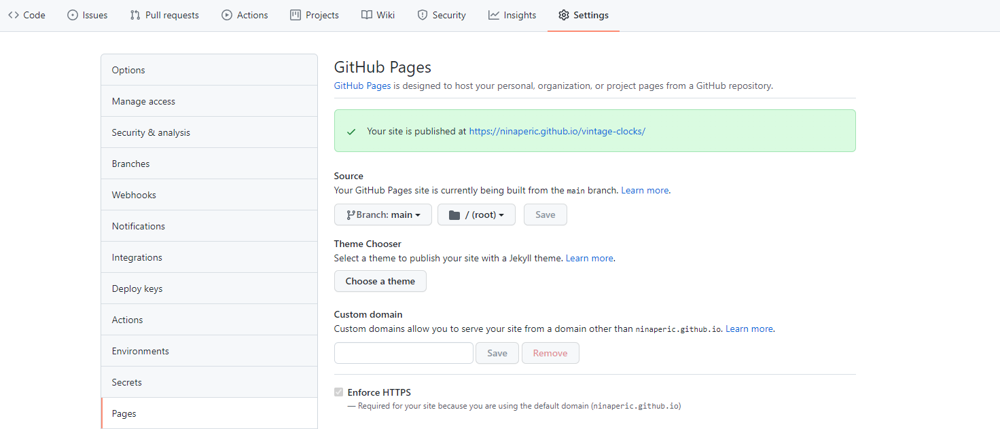
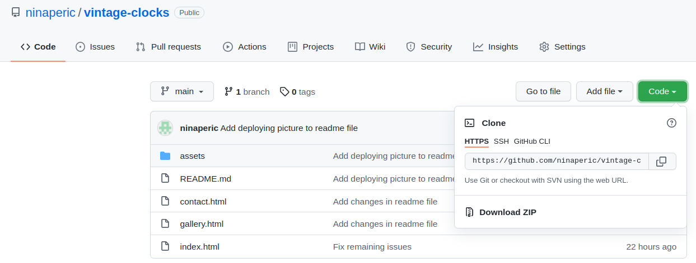

# Calculator

<a href="https://ninaperic.github.io/calculator/" alt="calculator" target="_blank">Calculator</a> is the second project for the Full Stack Software Developer (e-Commerce) Diploma at the Code Institute. The calculator allows basic arithmetic operations: addition, subtraction, multiplication and division.

## Contents

* [**User experience UX**](#user-experience-ux)
  * [User Stories](#user-stories)
  * [Site structure](#site-structure)
* [**Features**](#features)
  * [Existing Features (Functions and structure)](#existing-features-functions-and-structure)
  * [Future Features](#future-features)
* [**Technologies Used**](#technologies-used)
* [**Testing**](#testing)
    * [Validator Testing](#validator-testing)
    * [Responsivness Test](#responsivness-test)
    * [Browser Compatibility](#browser-compatibility)
    * [Known Bugs](#known-bugs)
* [**Deployment**](#deployment)
* [**Credits**](#credits)
    * [Content](#content)
    * [Credits](#credits)
* [**Acknowledgements**](#acknowledgements)

## User Experience (UX)

## User stories 

- As a user I want to understand what Vintage Clocks Shop is about.

## Features

### Existing Features (Functions and structure)

 
### Future Features

- Gallery becomes a shop page where user can select and add clocks to the shoping cart. 
- Add shopping cart page where the user can finish shopping.
- Add shopping cart icon to header.
- Add shopping functionality.

## Technologies Used

- HTML5: Used for the web site content.
- CSS: Used to style the web site.
- VS Code: The editor used for coding.
- Github: Used as version control system.
- Github Pages: Used to deploy web site online.

## Testing 

### Validator Testing 

- HTML
  - No errors were returned when passing through the official [W3C validator](https://validator.w3.org/nu/?doc=https%3A%2F%2Fninaperic.github.io%2Fcalculator%2F)
  
- CSS
  - No errors were found when passing through the official [(Jigsaw) validator](https://jigsaw.w3.org/css-validator/validator?uri=https%3A%2F%2Fninaperic.github.io%2Fcalculator%2F&profile=css3svg&usermedium=all&warning=1&vextwarning=&lang=en)

- JavaScript 
  - No errors were found when passing through the official[(Jshint) validator](assets/readme_images/Screenshot_1.png) 

### Responsivness Test

- Responsivness test was done using Chrome Dev tools.

|        | iPhone 6/7/8 Plus | Pixel 2 XL| iPhone 5 | iPad | iPad Pro | Display <1200px | Display >1200px |
|--------|-------------------|-----------|----------|------|----------|-----------------|-----------------|
| Render | pass              | pass      | pass     | pass | pass     | pass            | pass            |
| Images | pass              | pass      | pass     | pass | pass     | pass            | pass            |
| Links  | pass              | pass      | pass     | pass | pass     | pass            | pass            |

### Browser Compatibility

Vintage Clocks Shop is functional and properly displayed in the following web browsers: Google Chrome, Mozilla Firefox and Safari. 

### Known Bugs

- Resolved 
  - `alt` attribute was missing on some images.
  - Textarea head `type` attribute which was not valid.
  - Some images used `.webp` format which was not supported in Safari.

- Unresolved
  - One of the images fails to load in Safari.

 

## Deployment

- The site was deployed to GitHub pages. The steps to deploy are as follows: 

1. In the GitHub repository, navigate to the Settings tab 
2. From the source section drop-down menu, select the Master Branch
3. Once the master branch has been selected, the page will be automatically refreshed with a detailed ribbon display to indicate the successful deployment. 

The live link can be found here - https://ninaperic.github.io/vintage-clocks/

- Cloning project locally 

1. On the repository, click on the code tab.
2. Click on the code button the right.
3. In the Clone with HTTPS section, click on the clipboard icon to copy the given URL.
4. In your IDE of choice, open Git Bash.
5. Change the current working directory to the location where you want the cloned directory to be made.
6. Type git clone, and then paste the URL copied from GitHub.
7. Press enter and the local clone will be created.

## Credits  

### Content 

### Media

## Acknowledgements

This web site was created as a second project of five for the Full Stack Software Developer (e-Commerce) Diploma at the Code Institute. I wish to express my deepest gratitude to my mentor Precious Ijege for all the help trough the process of making this project.

Nina Perić 2021.

